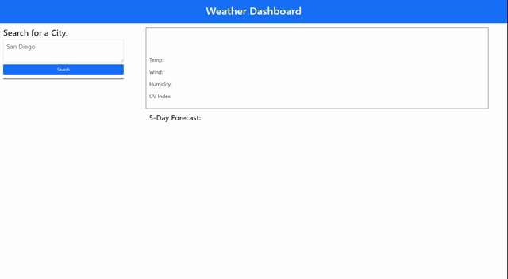

# weather-dashboard

## Description

A weather dashboard implemented using the OpenWeather API. Once a user enters a city of their choosing and clicks submit, the current weather data and a 5-day forecast is populated. A button for that city is also saved so you can click directly on that city instead of having to type it back in and resubmit. The city buttons are also saved so you can exit the site and come back to a city you have already asked for.

## Website

[Here!](https://ezequielmejiasmelo.github.io/weather-dashboard/)

## Tech Stack

- HTML
- CSS
- JavaScript
- jQuery
- Moment.js
- OpenWeather One Call API [Here](https://openweathermap.org/api/one-call-api)

## Support

Contact me if you have any questions

- [LinkedIn](https://www.linkedin.com/in/ezequiel-mejias-melo)
- [Github](https://github.com/EzequielMejiasMelo)